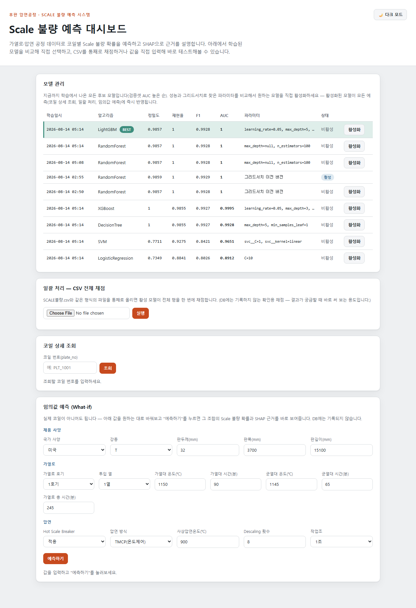
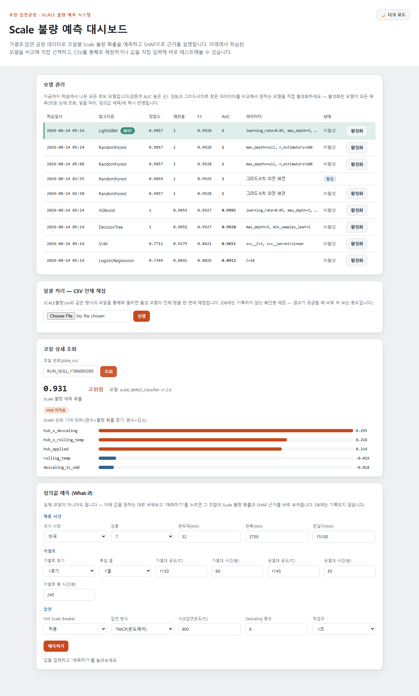

# Scale 불량 예측 시스템

후판 압연공정에서 발생하는 **Scale 불량**을 공정 데이터(가열로/압연 조건)로 예측하고, 왜 그렇게 예측했는지 SHAP으로 설명하는 시스템입니다. 원본 CSV에 대한 EDA에서 시작해, 데이터 모델링(PostgreSQL/SQLite 스키마) → FastAPI 백엔드(규칙 엔진 + ML 예측 서비스) → 정적 대시보드까지 전 구간을 구현했습니다.

## 핵심 발견 (EDA)

- **HSB(Hot Scale Breaker) 미적용 코일은 47건 중 47건(100%) 전량 Scale 불량**이었습니다.
- HSB를 적용한 상태에서도 **사상압연온도가 1000℃를 넘으면 불량률이 97.7%**로 급증합니다.
- 온도낙차(균열대→사상압연 온도차)가 양품(평균 228.9℃)과 불량(평균 170.7℃)에서 뚜렷하게 갈립니다.

이 세 가지 신호는 결정론적 규칙 엔진으로, 나머지 회색지대는 RandomForest/LightGBM 등 ML 모델로 판단하도록 설계했습니다.

## 스크린샷

| 모델 비교 & 선택 | 코일 상세(SHAP) |
|---|---|
|  |  |

## 폴더 구조

```
.
├── data/
│   ├── raw/SCALE불량.csv        # 원본 데이터 (용량이 작아 예외적으로 추적)
│   └── processed/                # 전처리 결과 (gitignore, 재생성 가능)
├── analysis/
│   ├── preprocessing.py          # EDA 기반 전처리 · 피처엔지니어링 · 시간 기준 분할 (스크립트 버전)
│   ├── preprocessing_eda.ipynb   # 위와 동일 내용 + 시각화 (노트북 버전, 실행 결과 포함)
│   └── model_training.ipynb      # 6개 모델 GridSearchCV 비교 학습 + SHAP 해석 (노트북 버전)
├── backend/                       # FastAPI 백엔드 + 정적 프런트엔드
│   ├── app.py                    # API 엔드포인트 (13종)
│   ├── models.py / db.py         # SQLAlchemy ORM / DB 세션
│   ├── schemas.py                # Pydantic 요청/응답 스키마
│   ├── rules.py                  # 결정론적 규칙 엔진 (HSB · 온도임계값 · 온도낙차)
│   ├── features.py               # 피처 엔지니어링 (학습/실시간/배치 서빙 공유)
│   ├── migrate_from_csv.py       # data/raw/*.csv → DB 마이그레이션
│   ├── train_model.py            # 6개 후보 모델 GridSearchCV 비교 학습 + 등록
│   ├── retrain.py                # 재학습 파이프라인
│   ├── prediction_service.py     # 실시간 예측 + SHAP + what-if 채점
│   ├── batch_scoring.py / batch_predict.py  # CSV 일괄 채점 (API 겸 CLI)
│   ├── schema.sql                # 운영 배포용 PostgreSQL DDL
│   ├── static/                   # 대시보드 (바닐라 HTML/CSS/JS, 빌드 도구 없음)
│   └── .claude/skills/           # Claude Code용 실행/검증 스킬
├── requirements.txt
└── .gitignore
```

## 기술 스택

| 계층 | 기술 |
|---|---|
| 언어 | Python 3.13 |
| API 서버 | FastAPI + Uvicorn |
| DB | SQLite(개발) / PostgreSQL(운영, `schema.sql`) — SQLAlchemy 2.0 ORM |
| 데이터 처리 | pandas |
| 모델링 | scikit-learn (LogisticRegression / DecisionTree / RandomForest / SVM), XGBoost, LightGBM |
| 모델 해석 | SHAP |
| 프런트엔드 | Vanilla HTML/CSS/JS (ES Modules), 빌드 도구 없음 |

## 시작하기

### 1. 환경 설정

```bash
python -m venv .venv
source .venv/bin/activate        # Windows: .venv\Scripts\activate
pip install -r requirements.txt
```

### 2. 데이터 적재 및 모델 학습 (최초 1회)

```bash
cd backend
python migrate_from_csv.py       # data/raw/SCALE불량.csv -> SQLite DB (5개 정규화 테이블)
python train_model.py            # 6개 모델 그리드서치 비교 학습 후 전부 등록 (최초 실행 시 최고 성능 모델 자동 활성화)
```

### 3. 서버 실행

```bash
cd backend
uvicorn app:app --reload
```

브라우저에서 `http://127.0.0.1:8000/app/` 접속.

### 4. 그 밖의 실행 경로

```bash
python backend/smoke_test_phase23.py                 # 백엔드 로직(적재/규칙엔진/예측) 스모크 테스트
python backend/batch_predict.py --csv <파일경로>      # CSV 일괄 채점 (CLI)
python backend/retrain.py                             # 신규 라벨 포함 재학습
```

## 주요 기능

- **실시간 예측**: 코일 1건의 공정 데이터를 받아 Scale 불량 확률 + SHAP 근거를 즉시 반환 (`/api/v1/rolling-records`)
- **규칙 기반 경보**: HSB 미적용, 온도 임계값 초과 등은 ML 추론 없이 즉시 판정
- **일괄 처리**: CSV 파일 전체를 활성 모델로 한 번에 채점 (대시보드 업로드 / API / CLI 3경로 지원)
- **임의값 예측(What-if)**: 실제 코일 없이 값을 직접 입력해 즉석 예측
- **모델 관리**: 학습된 모든 후보 모델(성능·그리드서치 파라미터)을 비교해 대시보드에서 직접 활성화
- **피드백 루프**: 육안 판정 결과를 반영해 재학습 → 새 모델을 비교 후 선택적으로 활성화

## 라이선스

미정 (팀 프로젝트 — 추후 결정)
